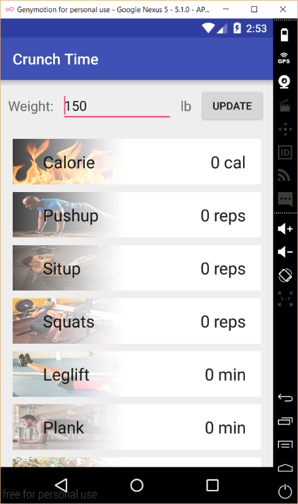
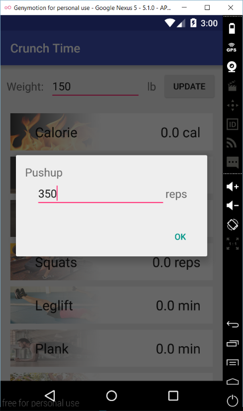
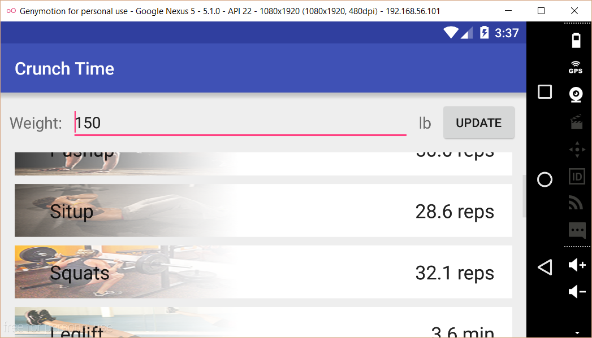

# PROG 01: Crunch Time

Crunch time is an android application for android smart phone that allows users to easily convert amount of daily exercises to calories burned and/or other exercises. Use this converter to discover exercises that suit you best.

## Authors

Jeff Lee ([jlee257@berkeley.edu](mailto:jlee257@berkeley.edu))

## Demo Video

[Watch Youtube video here] (https://youtu.be/Bmrib4xTrVI)

## Screenshots

*Feel free to enhance your README. For Markdown syntax, see [the GitHub Guides](https://guides.github.com/features/mastering-markdown/). Remove this line in your submission.*
